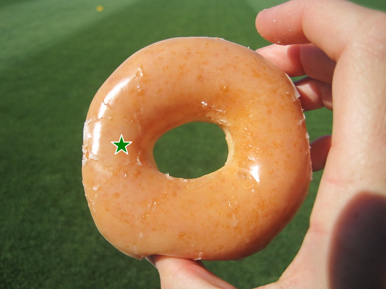
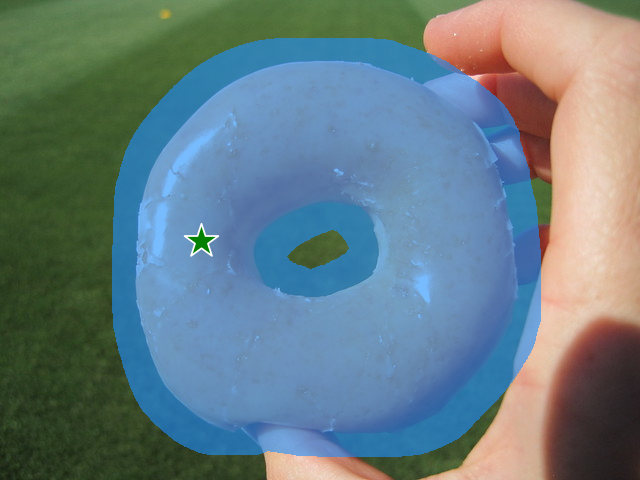
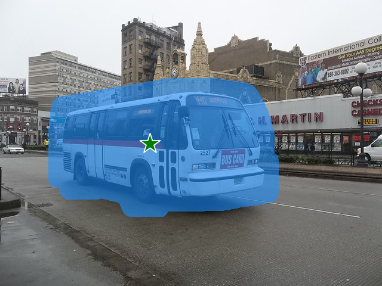

<p align="center">
  
</p>

# Inpaint-Anything
## Segment Anything Meets Image Inpainting
<p align="center">
  
</p>


## Inpaint Anything Features
- [x] Remove Anything
- [x] Fill Anything
- [ ] Replace Anything (coming soon)
- [ ] Demo Website (coming soon)


## Remove Anything
**Click** on an object in the image (2K image supported!), and Inpainting Anything will **remove** it instantly!
- Click on an object;
- [Segment Anything Model](https://segment-anything.com/) (SAM) segments the object out;
- Inpainting models (e.g., [LaMa](https://advimman.github.io/lama-project/)) fill the "hole".

<table>
  <tr>
    <td></td>
    <td></td>
    <td></td>
  </tr>
</table>

<table>
  <tr>
    <td></td>
    <td></td>
    <td></td>
  </tr>
</table>

<table>
  <tr>
    <td></td>
    <td></td>
    <td></td>
  </tr>
</table>

<table>
  <tr>
    <td></td>
    <td></td>
    <td></td>
  </tr>
</table>

<table>
  <tr>
    <td></td>
    <td></td>
    <td></td>
  </tr>
</table>

### Installation
Requires `python>=3.8`
```bash
python -m pip install torch torchvision torchaudio
python -m pip install -e segment_anything
python -m pip install -r lama/requirements.txt 
```

### Usage
Specify an image and a point, and Inpaint-Anything will remove the object at the point.
```bash
python remove_anything.py \
    --input_img ./example/remove-anything/dog.jpg \
    --point_coords 200 450 \
    --point_labels 1 \
    --dilate_kernel_size 15 \
    --output_dir ./results \
    --sam_model_type "vit_h" \
    --sam_ckpt sam_vit_h_4b8939.pth \
    --lama_config ./lama/configs/prediction/default.yaml \
    --lama_ckpt big-lama
```

## Fill Anything
**Click** on an object, **type** in what you want to fill, and Inpaint Anything will **fill** it!
- Click on an object;
- [SAM](https://segment-anything.com/) segments the object out;
- Input a text prompt;
- Text-prompt-guided inpainting models (e.g., [Stable Diffusion](https://github.com/CompVis/stable-diffusion)) fill the "hole" according to the text.

<table>
  <caption style="text-align: center;">Text prompt: "a teddy bear on a bench"</caption>
    <tr>
      <td></td>
      <td></td>
      <td></td>
    </tr>
</table>

<table>
  <caption style="text-align: center;">Text prompt: "a camera lens in the hand"</caption>
    <tr>
      <td></td>
      <td></td>
      <td></td>
    </tr>
</table>

<table>
  <caption style="text-align: center;">Text prompt: "an aircraft carrier on the sea"</caption>
    <tr>
      <td></td>
      <td></td>
      <td></td>
    </tr>
</table>

<table>
  <caption style="text-align: center;">Text prompt: "a sports car on a road"</caption>
    <tr>
      <td></td>
      <td></td>
      <td></td>
    </tr>
</table>


## Acknowledgments
- [Segment Anything](https://github.com/facebookresearch/segment-anything)
- [LaMa](https://github.com/advimman/lama)
- [Stable Diffusion](https://github.com/CompVis/stable-diffusion)


 ## Other Interesting Repoepositories
- [Awesome Anything](https://github.com/VainF/Awesome-Anything)
- [Grounded SAM](https://github.com/IDEA-Research/Grounded-Segment-Anything)


