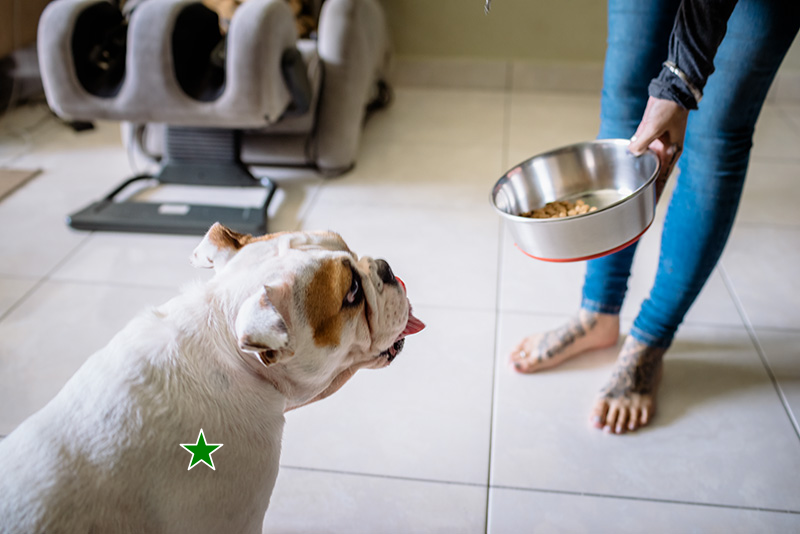
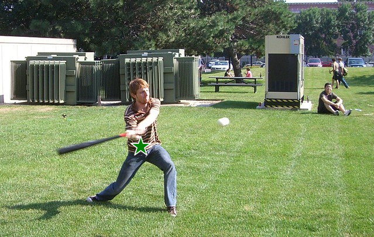

<p align="center">
  
</p>

# Inpaint-Anything
## Segment Anything Meets Image Inpainting
<p align="center">
  
</p>


## Inpaint Anything Features
- [x] Remove Anything
- [ ] Fill Anything (coming soon)
- [ ] Replace Anything (coming soon)
- [ ] Demo Website (coming soon)


## Remove Anything
**Click** on an object in the image (2K image supported!), and Inpainting Anything will **remove** it instantly!
- Click on an object;
- [Segment Anything Model](https://segment-anything.com/) (SAM) segments the object out;
- Inpainting models (e.g., [LaMa](https://advimman.github.io/lama-project/)) fill the "hole".

<table>
  <tr>
    <td></td>
    <td></td>
    <td></td>
  </tr>
</table>

<table>
  <tr>
    <td></td>
    <td></td>
    <td></td>
  </tr>
</table>

<table>
  <tr>
    <td></td>
    <td></td>
    <td></td>
  </tr>
</table>

<table>
  <tr>
    <td></td>
    <td></td>
    <td></td>
  </tr>
</table>

<table>
  <tr>
    <td></td>
    <td></td>
    <td></td>
  </tr>
</table>

### Installation
Requires `python>=3.8`
```bash
python -m pip install torch torchvision torchaudio
python -m pip install -e segment_anything
python -m pip install -r lama/requirements.txt 
```

### Usage
Specify an image and a point, and Inpaint-Anything will remove the object at the point.
```bash
python segment_inpaint_one_img.py \
    --input_img ./example/remove-anything/dog.jpg \
    --point_coords 200 450 \
    --point_labels 1 \
    --output_dir ./results \
    --sam_model_type "vit_h" \
    --sam_ckpt sam_vit_h_4b8939.pth \
    --lama_config ./lama/configs/prediction/default.yaml \
    --lama_ckpt lama/big-lama
```

## Acknowledgments
 - [SAM](https://github.com/facebookresearch/segment-anything) from Meta AI
 - Inpainting models are from [LaMa](https://github.com/advimman/lama)

 ## Other Interesting Repo
- [Awesome Anything](https://github.com/VainF/Awesome-Anything)
- [Grounded SAM](https://github.com/IDEA-Research/Grounded-Segment-Anything)


