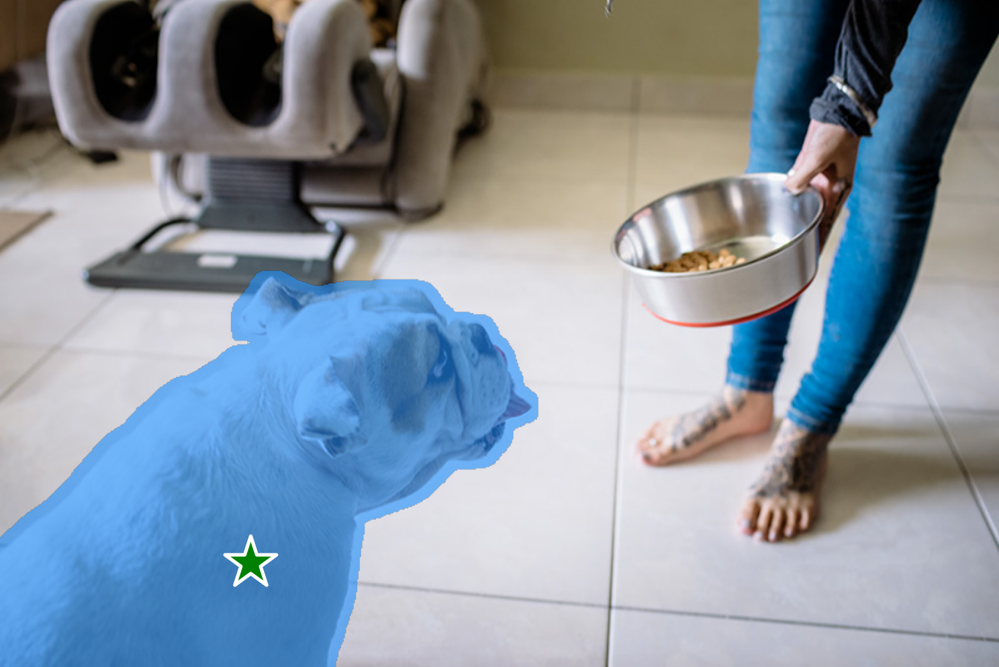
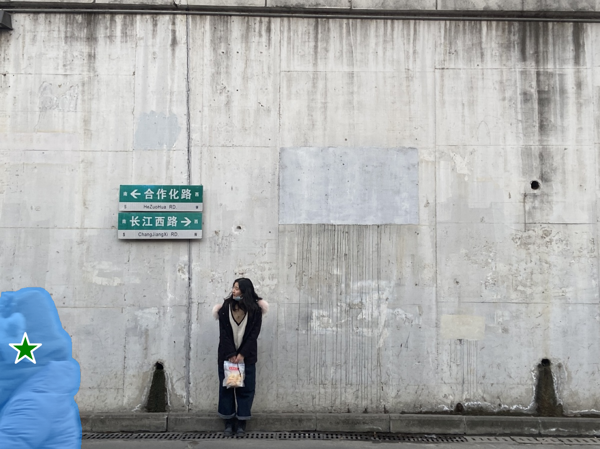

  

# **Inpaint-Anything**
## Segment Anything Meets Image Inpainting

  

## Inpaint Anything Features
- [x] Remove Anything
- [ ] Fill Anything
- [ ] Replace anything

## Remove Anything
Click on an object in the image (2K image supported!), and Inpainting Anything will remove it instantly!
- Click on an object, [Segment Anything Model](https://segment-anything.com/) (SAM) is used to segment the object and obtain an object mask.
- With the mask, inpainting models (e.g., [LaMa](https://advimman.github.io/lama-project/)) fill the "hole".

<table>
  <tr>
    <td></td>
    <td></td>
    <td></td>
  </tr>
</table>

<table>
  <tr>
    <td></td>
    <td></td>
    <td></td>
  </tr>
</table>

<table>
  <tr>
    <td></td>
    <td></td>
    <td></td>
  </tr>
</table>

<table>
  <tr>
    <td></td>
    <td></td>
    <td></td>
  </tr>
</table>

<table>
  <tr>
    <td></td>
    <td></td>
    <td></td>
  </tr>
</table>

## Acknowledgments
 - [SAM](https://github.com/facebookresearch/segment-anything) from Meta AI
 - Inpainting models are from [LaMa](https://github.com/advimman/lama)

