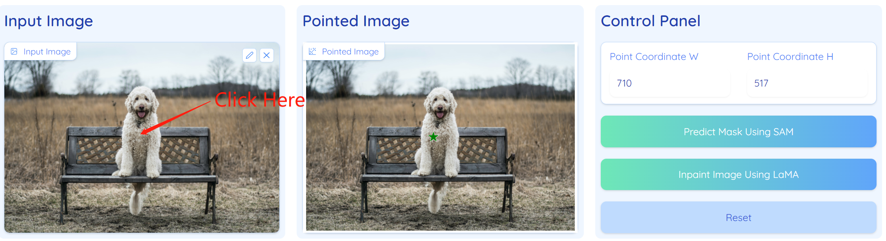
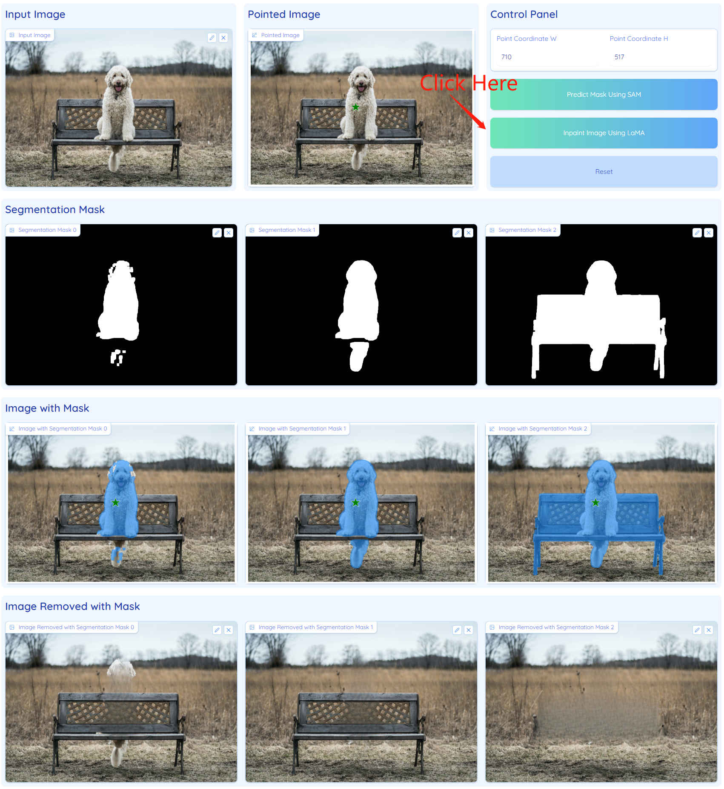

# Web UI for Inpaint Anything
We provide a web UI for people who want to run the demo web locally.

## Usage
  We use [Gradio](https://gradio.app/) to build our web UI. First, install Gradio through pip.
  ```
  pip install gradio
  ```
  Then go to `./app`. 
  ```
  cd ./app
  ```
  Make sure that you have downloaded the pretrained SAM and LaMa models. If they are under `./pretrained_models`. Run the demo web via the following command.
  ```
  python app.py \
        --lama_config ./lama/configs/prediction/default.yaml \
        --lama_ckpt ./pretrained_models/big-lama \
        --sam_ckpt ./pretrained_models/sam_vit_h_4b8939.pth
  ```

## Instruction
There are 4 steps for *Remove Anything*:
- Step 1: Upload your image;
- Step 2: Click on the object that you want to remove or input the coordinates to specify the point location, and wait until the pointed image shows;
- Step 3: Hit the "Predict Mask Using SAM" button, and wait until the segmentation results show;
- Step 4: Hit the "Inpaint Image Using Lama" button, and wait until the inpainting results show.

if need, you can hit the "Reset" button to reset the web to the initial state.

### Example
Step 1 & 2:
<p align="center"></p>

Step 3:
<p align="center"></p>

Step 4:
<p align="center"></p>

