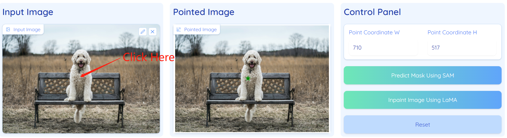
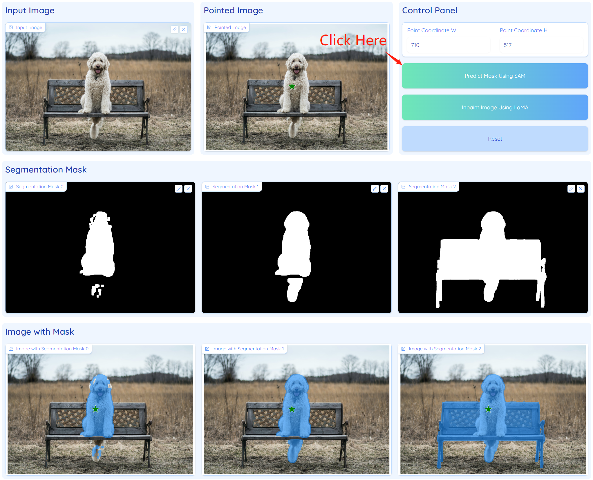
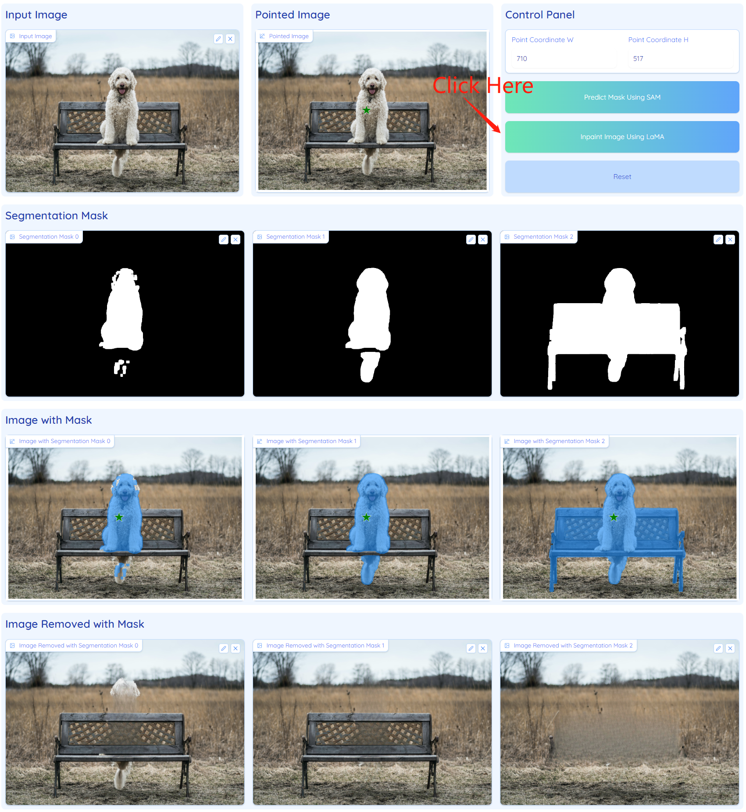

# Web UI for Inpaint Anything
We provide a web UI for people who want to run the demo web locally.

## Usage
  We use [Gradio](https://gradio.app/) to build our web UI. It is included in
  the project requirements:
  ```
  pip install -r requirements.txt
  ```
  Then go to `./app`. The script chdirs to the project root on startup, so
  paths below are relative to the root, not to `./app`.
  ```
  cd ./app
  ```
  Make sure you have downloaded the SAM 3 and LaMa weights (see
  [Download the weights](../README.md#download-the-weights)). Then run:
  ```
  python app.py \
        --lama_config ./lama/configs/prediction/default.yaml \
        --lama_ckpt ./pretrained_models/big-lama \
        --sam_model_type sam3 \
        --sam_ckpt ./pretrained_models/sam3.pt
  ```
  The UI listens on `0.0.0.0:7860` by default. Use `--port` to change it and
  `--share` to expose a public Gradio link.

  To fall back to the lighter MobileSAM backend:
  ```
  python app.py --sam_model_type vit_t --sam_ckpt ./weights/mobile_sam.pt
  ```

## Video tab
The **Video** tab removes an object from a whole clip:
- Upload a video; its first frame appears below the player;
- Click the object in that frame, or type its name into *Select by text*;
- Hit **Remove from Video**.

SAM 3 propagates the first-frame mask across every frame and ProPainter fills
the hole. Tick *Half precision* if you run out of GPU memory on long clips. The
tracked mask is shown next to the result so you can tell a bad mask apart from a
bad inpaint.

## Instruction
There are 3 steps for *Remove Anything*:
- Step 1: Upload your image;
- Step 2: Pick the object, either by clicking on it (the mask appears right
  away) or by typing a phrase like `dog` into **Select by Text** and hitting
  **Segment by Text**;
- Step 3: Hit **Inpaint Image**, and wait until the inpainting result shows.

For *Replace Anything*, select the object the same way, type what background
you want into **Text Prompt**, then hit **Replace Anything with SD**.

The **Dilate Kernel Size** slider grows the mask before inpainting, which helps
remove leftover halos around the object's edge.

If needed, you can hit the "Reset" button to reset the web to the initial state.

> Text selection requires `--sam_model_type sam3`; it is unavailable on the
> SAM 1 / MobileSAM backends.

### Example
Step 1 & 2:
<p align="center"></p>

Step 3:
<p align="center"></p>

Step 4:
<p align="center"></p>
